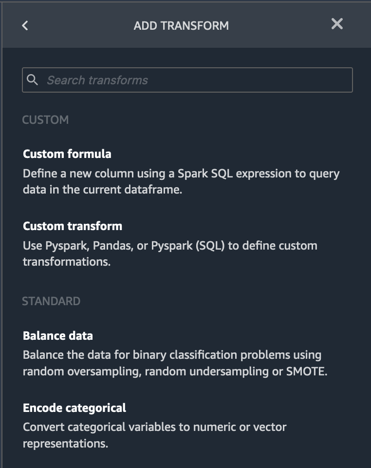
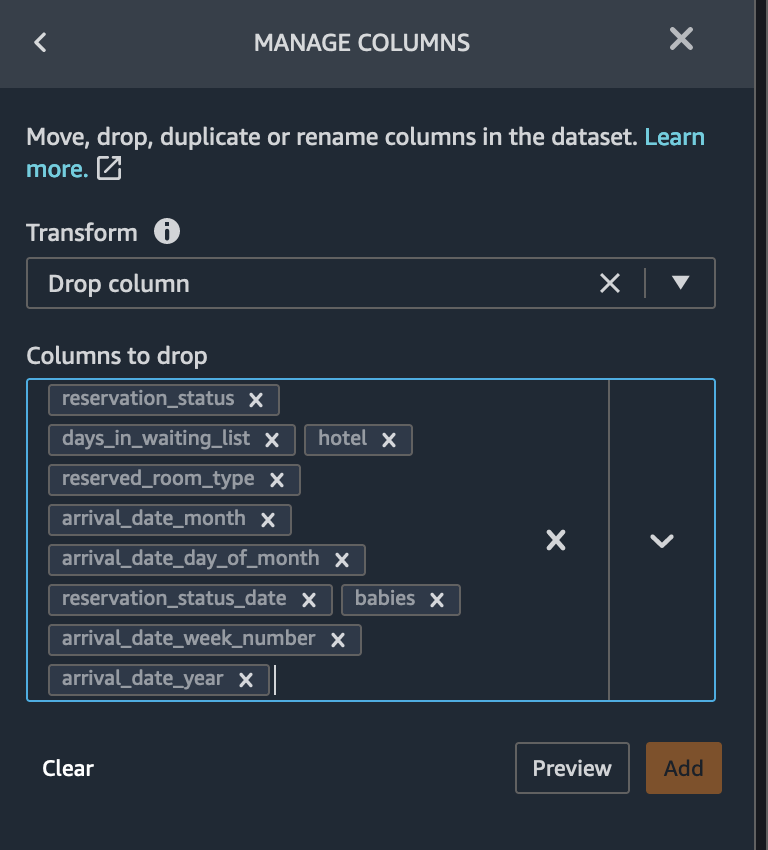
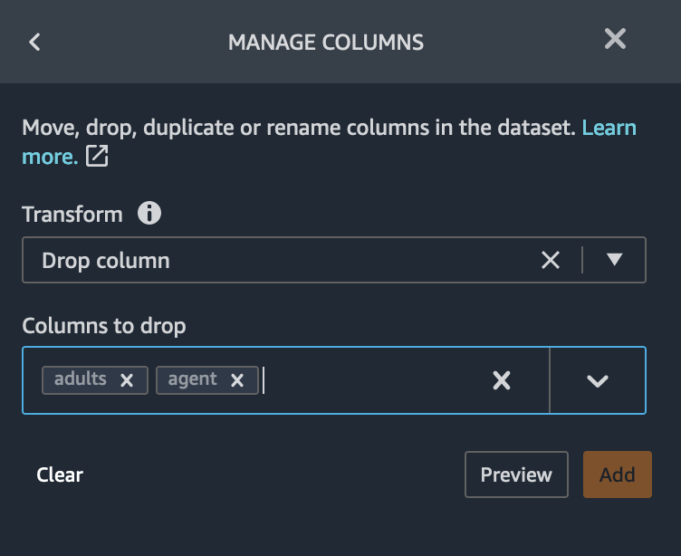
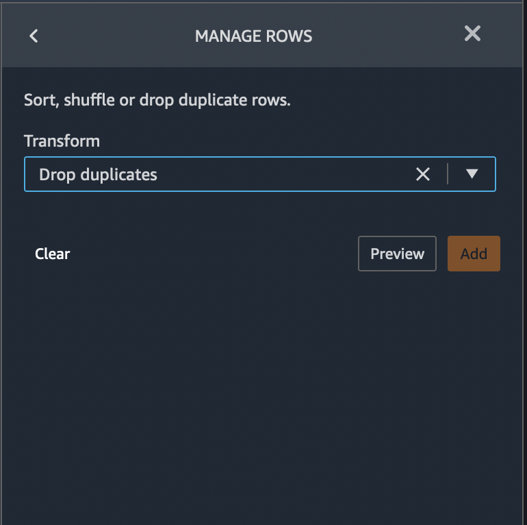
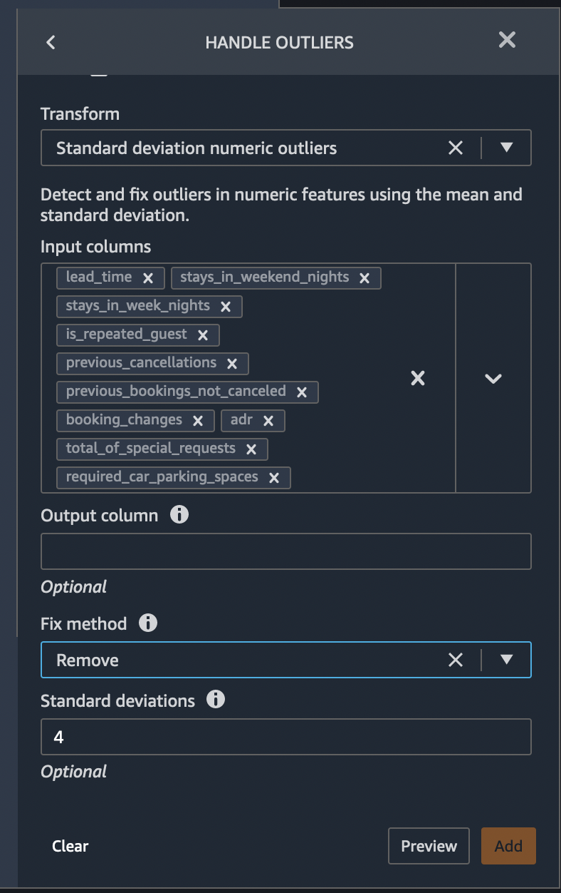
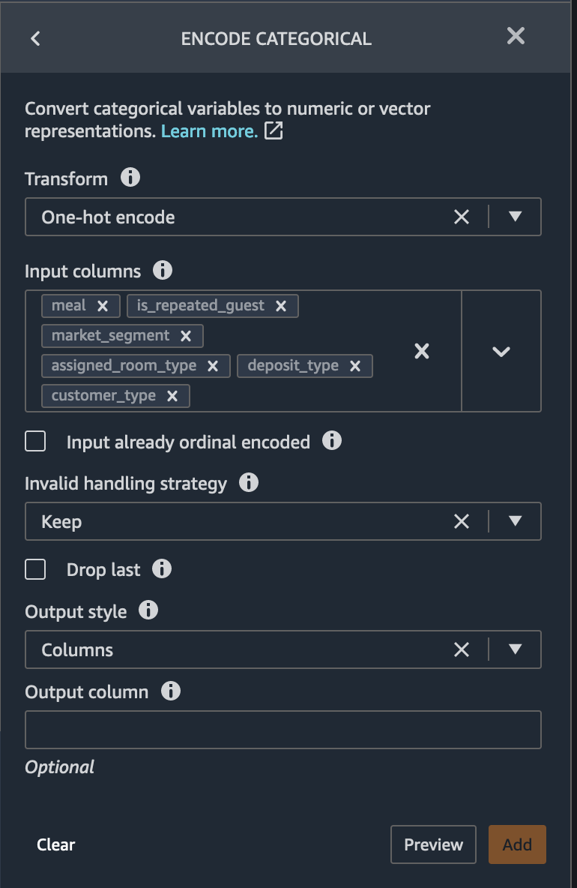
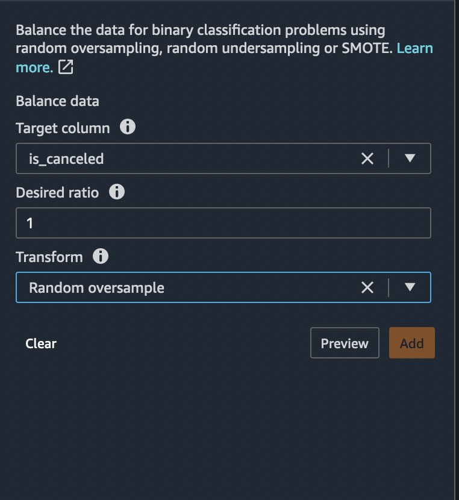
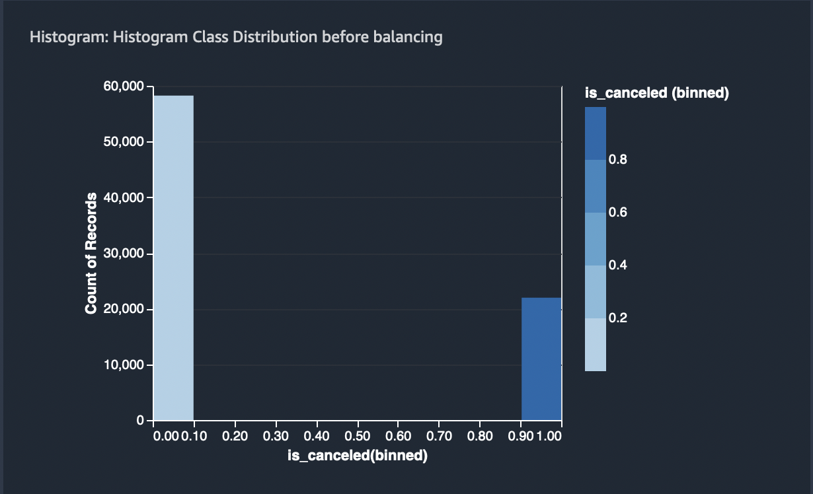
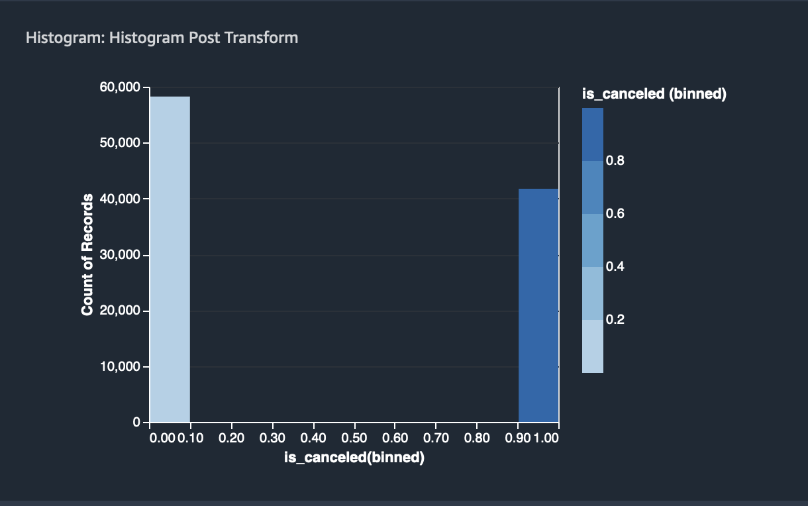
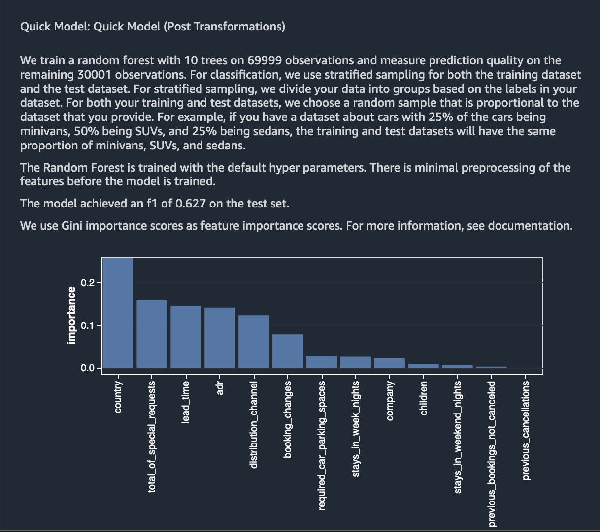

# Data Transformations


Based on the Data explorations carried out in previous step, we are now ready to apply transformations to the data. 
Amazon SageMaker Data Wrangler provides numerous ML data transforms to streamline cleaning, transforming, and featurizing your data. When you add a transform, it adds a step to the data flow. Each transform you add modifies your dataset and produces a new dataframe. All subsequent transforms apply to the resulting dataframe.

Data Wrangler includes built-in transforms, which you can use to transform columns without any code. You can also add custom transformations using PySpark, Pandas, and PySpark SQL. Some transforms operate in place, while others create a new output column in your dataset.

In order to apply an action on the imported data, select the **Add Transform** option on right clicking the the **Data Types** block. In the displayed window, select **Add Steps** to display **Add Transform** window.

 


### Drop Columns 
 Now we will drop columns based on the analyses we performed in the previous section. 

-  based on target leakage : drop `reservation_status`

- redundant columns : drop columns that are redundant - `days_in_waiting_list`, `hotel`, `reserved_room_type`, `arrival_date_month`, `reservation_status_date`, `babies` and `arrival_date_day_of_month`

- based on linear correlation results : drop columns `arrival_date_week_number`, `arrival_date_year` as correlation values for these feature (column) pairs are greater than the recommended threshold of 0.90. 

- based on non-linear correlation results: drop `reservation_status`. This column was already marked to be dropped based on Target leakage analysis. 
 
 we can drop all these columns in one go. To drop columns, choose **Manage columns** transform from the **Add Transform** window.  Then select the **Drop column** option from **Manage columns** transform. 
 
Please select the the column names we want to drop as shown in the image below and hit **Preview**.  
 
 
 
 
If the Preview is OK, click **Add** to add the transform in the data flow. 

Further, based on the multi-colinearity analysis results, we can also drop the columns `adults` and `agent` for whom the variance inflation factor scores are greater than 5. Please select the the column names we want to drop and hit **Preview**.  


 
 
 If the Preview is OK, click **Add** to add the transform in the data flow. 


### Drop Duplicate Rows
To drop the duplicate rows that we identified based on the analysis we did in the previous section. To drop columns, choose **Manage rows** transform from the **Add Transform** window.  Then select the **Drop duplicates** option from **Manage rows** transform and hit **Preview**.  


 

  If the Preview is OK, click **Add** to add the transform in the data flow. 

 
### Handle Outliers 
An outlier can cause serious problems in statistical analysis. Machine learning models are sensitive to the distribution and range of feature values. Outliers, or rare values, can negatively impact model accuracy and lead to longer training times. When you define a Handle outliers transform step, the statistics used to detect outliers are generated on the data available in Data Wrangler when defining this step. These same statistics are used when running a Data Wrangler job.

To handle outliers, choose **Handle outliers** transform from the **Add Transform** window.  
Please select the following parameters and hit **Preview**.  

- `Transform`: `Standard deviation numeric outliers`
- `Fix method` : `Remove`
- `Standard deviations`: `4` 
- `Input columns`:  `lead_time`,`stays_in_weekend_nights`, `stays_in_weekday_nights`, `is_repeated_guest`, `prev_cancellations`,  `prev_bookings_not_canceled`, `booking_changes`, `adr`, `total_of_specical_requests`, `required_car_parking_spaces`,
    





 If the Preview is OK, click **Add** to add the transform in the data flow. 
 

### Handle Missing Values 
To handle outliers, choose **Handle missing values** transform from the **Add Transform** window.  We can do the following to handle missing values in our feature columns using Data Wrangler. 


 - Missing values in **Children** column : Majority of the visitors were not accompanied by children and hence missing data can be replaced by number of children = 0.
 


 Please hit **Preview** to look at the transform preview, and if it is OK, click **Add** to add the transform in the data flow. 
 
- Missing values in **Country** column 
Iterating through the country column reveals that most of the clients are from Europe. Therefore, all the missing values in the country column are replaced with the country of maximum occurrence - Portugal (PRT). Fill missing country column with `PRT` based on value counts 
 


Please hit **Preview** to look at the transform preview, and if it is OK, click **Add** to add the transform in the data flow. 

- Custom Transform - Meal type has Undefined category, changing the Undefined value to the most used which is BB by implementing a custom pyspark transform with two simple lines of code. This can be done by choosing **Custom transform** transform from the **Add Transform** window. Specify the name of the transform, and paste following code in the transform as shown in figure below. 
 
 
 
 
```python
from pyspark.sql.functions import when

df = df.withColumn('meal', when(df.meal == 'Undefined', 'BB').otherwise(df.meal))
```

Please hit **Preview** to look at the transform preview, and if it is OK, click **Add** to add the transform in the data flow. 

 ### Numeric Normalization 
Normalization is a scaling technique in which values are shifted and rescaled so that they end up ranging between 0 and 1. It is also known as Min-Max scaling. Standardization is another scaling technique where the values are centered around the mean with a unit standard deviation. This means that the mean of the attribute becomes zero and the resultant distribution has a unit standard deviation.
 
For our example use case, let's normalize the numeric feature columns to a standard scale [0,1]. scale-numeric

From Data Wrangler's list of pre-built transforms, choose **Process numeric** and apply the **min-max scaler** between values 0 and 1 as shown above.

 

We will need to apply this scaling to the following feature columns:

    lead_time
    stays_in_weekend_nights
    stays_in_weekday_nights
    is_repeated_guest
    prev_cancellations
    prev_bookings_not_canceled
    booking_changes
    adr
    total_of_specical_requests
    required_car_parking_spaces
    
    
### Handle Categorical Data

Categorical data is usually composed of a finite number of categories, where each category is represented with a string. Encoding categorical data is the process of creating a numerical representation for categories. With Data Wrangler, we can select Ordinal encode to encode categories into an integer between 0 and the total number of categories in the Input column you select. Select **One-hot encode** option from **Encode Categories Transform** to use one-hot encoding or use similarity encoding when you have the following:

    - A large number of categorical variables
    - Noisy data

One-hot transform can be applied to our dataset as shown in the figure below.

 

One hot encoding can be applied to the following 6 categorical columns. 

`meal`, `is_repeated_guest`, `market_segment`, `assigned_room_type`, `deposit_type`, `customer_type`

### Balancing the target variable 

DataWrangler also helps to balance the target variable (column) for class imbalance. Let's presume the following for the negative and positive cases.

    is_canceled = 0 (negative case)
    is_canceled = 1 (positive case)

In Data Wrangler, we can handle class imbalance using 3 different techniques.

    Random Undersample
    Random Oversample
    SMOTE

From the Data Wrangler's transform pane, choose Balance data as the group and choose Random Oversample for the Transform field as shown in the picture below.

`is_canceled` = 0 (negative case)
`is_canceled` = 1 (positive case)

 

The state of the classes before and after balancing is as follows:

The ratio of positive to negative case = ~0.38 




After balancing, the ratio is 1 


### Quick Model
Given, we have applied most of the needed transformations on our feature columns, we can now create a Quick Model again using the transformed features to identify the predictive ability of our features and take a look at their attribution towards prediction.

It is a good practice to run a Quick Model everytime we make a set of feature transforms. Previously, we ran a Quick Model analysis using the raw features. The results of this previous run was mostly incorrect and misleading, given, we haven't fixed most of the correlation and other issues with our dataset.

The below figure shows the results of the newly run Quick Model created using the transformed features. As you can see, the Quick Model achieved an F1 score of 62% on the test data. The top 5 most contributing features towards this score are as follows which is different from what we see previously.

    lead_time
    country
    customer_type_Transient
    required_car_parking_spaces
    booking_changes

Craete a quick model, similar to one we created in the Data Exploration step. 




### Next Steps

As a next step, we will export the transformed data for further use. Please refer to **[Readme](./README.md)** and follow steps for Data Export.
